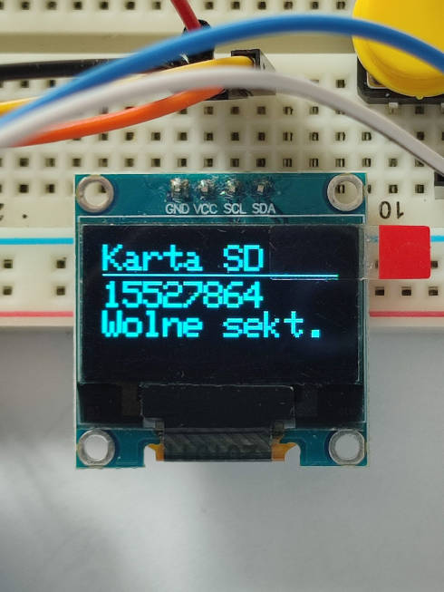

## Weather Station
Weather monitoring project based on STM32 MCU.

## Table of Contents
- [General info](#general-info)
- [Features](#features)
- [Demo](#demo)
- [Software](#software)
- [Hardware used](#hardware-used)

## General info
System for monitoring local weather, can also be used as a clock. Designed to be easy to use and power efficent. Data collected from sensors can be easily extracted in a format supported by all popular programming languages and tools like Excel.

## Features
Full feature list of my project:
* Clock
* Display, that shows:
    * Temperature in Celsius
    * Relative humidity
    * Atmospheric pressure in hPa
* SD Card support:
    * Collected data (time, temperature, humidity, pressure) is automatically saved on SD Card in .csv format
    * Filesystem information screen available in UI
* Easy date and time change via UI
* Three buttons, used for easy and simple UI navigation

## Demo
UI navigation: 

 Time adjustment: 

 Start: 

 SD Card info:

Saved data exported to Excel: 

## Software
Software running on my project heavily utilizes FreeRTOS (with CMSIS layer), interrupts and DMA controller. In order to save power, MCU is put to sleep when there are no tasks running. 
Drivers implemented from scratch for this project:
* DHT-11, interrupt based, utilizes µs timer.
* LPS25HB, simple driver for reading pressure that utilizes DMA. 

## Hardware used
* [NUCELO-F303RE](https://www.st.com/en/evaluation-tools/nucleo-f303re.html)
* [DHT11](https://www.adafruit.com/product/386)
* [LPS25HB](https://www.st.com/en/mems-and-sensors/lps25hb.html)
* [MicroSD breakout board](https://www.adafruit.com/product/254)
* SSD1306 OLED
* MicroSD Card (optional)
* Two physical push buttons
* Resistors
* Jumper wires
* Breadboard